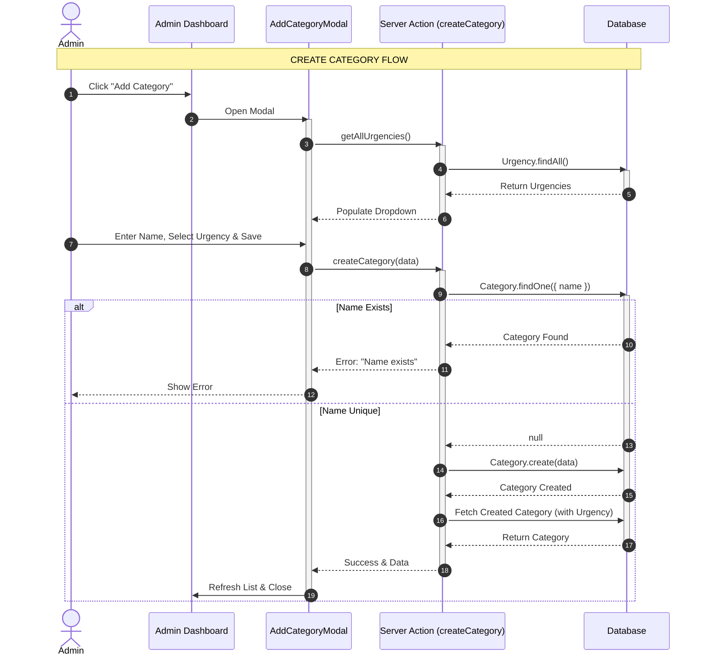
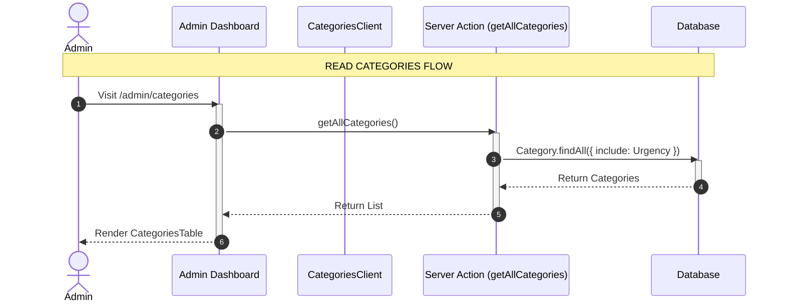
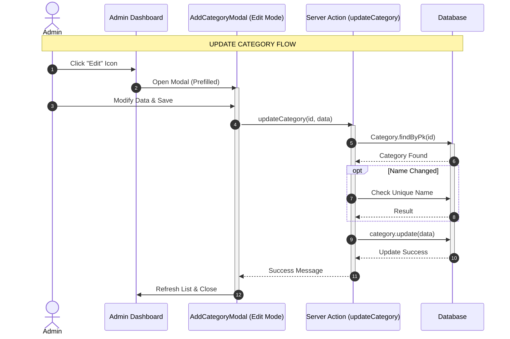
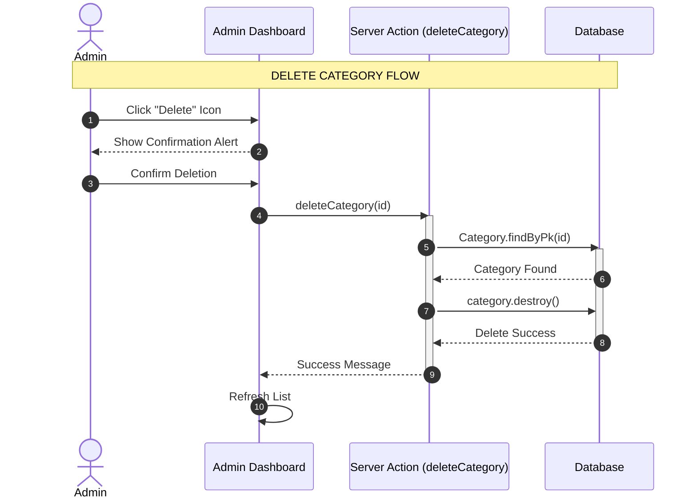

# Category CRUD Sequence Diagrams

## 1. Create Category

```mermaid
sequenceDiagram
    autonumber
    actor Admin
    participant UI as Admin Dashboard
    participant Modal as AddCategoryModal
    participant Action as Server Action (createCategory)
    participant DB as Database

    Note over Admin, DB: CREATE CATEGORY FLOW
    Admin->>UI: Click "Add Category"
    UI->>Modal: Open Modal
    activate Modal
    Modal->>Action: getAllUrgencies()
    activate Action
    Action->>DB: Urgency.findAll()
    activate DB
    DB-->>Action: Return Urgencies
    deactivate DB
    Action-->>Modal: Populate Dropdown
    deactivate Action

    Admin->>Modal: Enter Name, Select Urgency & Save
    Modal->>Action: createCategory(data)
    activate Action
    Action->>DB: Category.findOne({ name })
    activate DB
    alt Name Exists
        DB-->>Action: Category Found
        Action-->>Modal: Error: "Name exists"
        Modal-->>Admin: Show Error
    else Name Unique
        DB-->>Action: null
        Action->>DB: Category.create(data)
        DB-->>Action: Category Created
        Action->>DB: Fetch Created Category (with Urgency)
        DB-->>Action: Return Category
        deactivate DB
        Action-->>Modal: Success & Data
        deactivate Action
        Modal->>UI: Refresh List & Close
    end
    deactivate Modal
```

## 2. Read Categories

```mermaid
sequenceDiagram
    autonumber
    actor Admin
    participant UI as Admin Dashboard
    participant Client as CategoriesClient
    participant Action as Server Action (getAllCategories)
    participant DB as Database

    Note over Admin, DB: READ CATEGORIES FLOW
    Admin->>UI: Visit /admin/categories
    activate UI
    UI->>Action: getAllCategories()
    activate Action
    Action->>DB: Category.findAll({ include: Urgency })
    activate DB
    DB-->>Action: Return Categories
    deactivate DB
    Action-->>UI: Return List
    deactivate Action
    UI-->>Admin: Render CategoriesTable
    deactivate UI
```

## 3. Update Category

```mermaid
sequenceDiagram
    autonumber
    actor Admin
    participant UI as Admin Dashboard
    participant Modal as AddCategoryModal (Edit Mode)
    participant Action as Server Action (updateCategory)
    participant DB as Database

    Note over Admin, DB: UPDATE CATEGORY FLOW
    Admin->>UI: Click "Edit" Icon
    UI->>Modal: Open Modal (Prefilled)
    activate Modal
    Admin->>Modal: Modify Data & Save
    Modal->>Action: updateCategory(id, data)
    activate Action
    Action->>DB: Category.findByPk(id)
    activate DB
    DB-->>Action: Category Found
    opt Name Changed
        Action->>DB: Check Unique Name
        DB-->>Action: Result
    end
    Action->>DB: category.update(data)
    DB-->>Action: Update Success
    deactivate DB
    Action-->>Modal: Success Message
    deactivate Action
    Modal->>UI: Refresh List & Close
    deactivate Modal
```

## 4. Delete Category

```mermaid
sequenceDiagram
    autonumber
    actor Admin
    participant UI as Admin Dashboard
    participant Action as Server Action (deleteCategory)
    participant DB as Database

    Note over Admin, DB: DELETE CATEGORY FLOW
    Admin->>UI: Click "Delete" Icon
    UI-->>Admin: Show Confirmation Alert
    Admin->>UI: Confirm Deletion
    UI->>Action: deleteCategory(id)
    activate Action
    Action->>DB: Category.findByPk(id)
    activate DB
    DB-->>Action: Category Found
    Action->>DB: category.destroy()
    DB-->>Action: Delete Success
    deactivate DB
    Action-->>UI: Success Message
    deactivate Action
    UI->>UI: Refresh List
```
