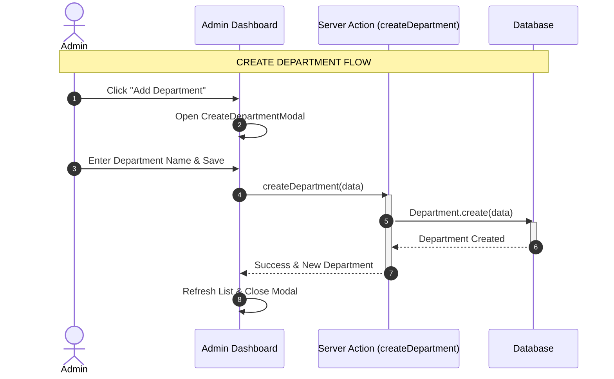
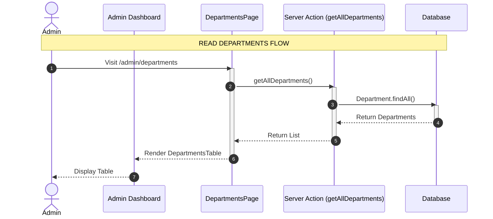
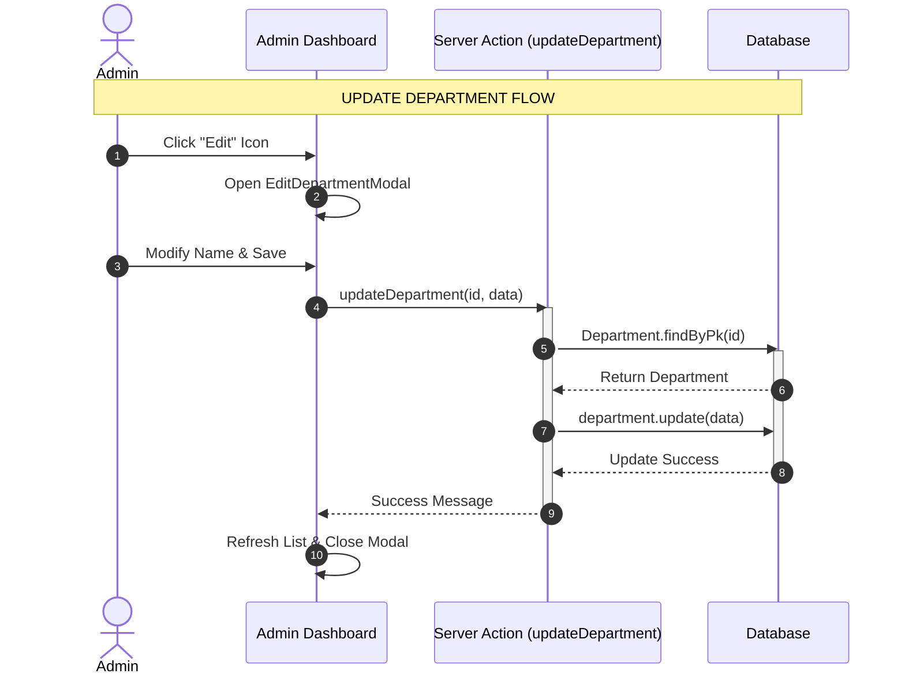
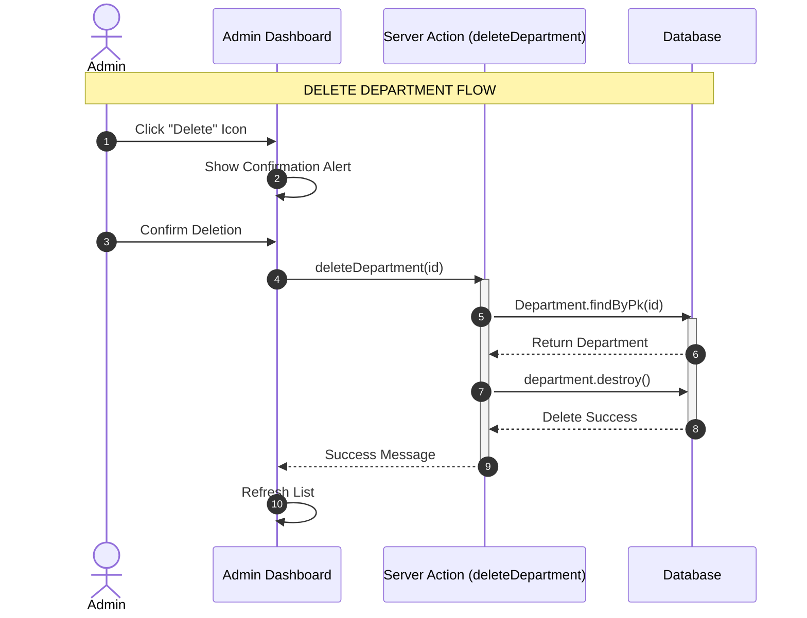

# Department CRUD Sequence Diagrams

## 1. Create Department

```mermaid
sequenceDiagram
    autonumber
    actor Admin
    participant UI as Admin Dashboard
    participant Action as Server Action (createDepartment)
    participant DB as Database

    Note over Admin, DB: CREATE DEPARTMENT FLOW
    Admin->>UI: Click "Add Department"
    UI->>UI: Open CreateDepartmentModal
    Admin->>UI: Enter Department Name & Save
    UI->>Action: createDepartment(data)
    activate Action
    Action->>DB: Department.create(data)
    activate DB
    DB-->>Action: Department Created
    deactivate DB
    Action-->>UI: Success & New Department
    deactivate Action
    UI->>UI: Refresh List & Close Modal
```

## 2. Read Departments

```mermaid
sequenceDiagram
    autonumber
    actor Admin
    participant UI as Admin Dashboard
    participant Page as DepartmentsPage
    participant Action as Server Action (getAllDepartments)
    participant DB as Database

    Note over Admin, DB: READ DEPARTMENTS FLOW
    Admin->>Page: Visit /admin/departments
    activate Page
    Page->>Action: getAllDepartments()
    activate Action
    Action->>DB: Department.findAll()
    activate DB
    DB-->>Action: Return Departments
    deactivate DB
    Action-->>Page: Return List
    deactivate Action
    Page-->>UI: Render DepartmentsTable
    deactivate Page
    UI-->>Admin: Display Table
```

## 3. Update Department

```mermaid
sequenceDiagram
    autonumber
    actor Admin
    participant UI as Admin Dashboard
    participant Action as Server Action (updateDepartment)
    participant DB as Database

    Note over Admin, DB: UPDATE DEPARTMENT FLOW
    Admin->>UI: Click "Edit" Icon
    UI->>UI: Open EditDepartmentModal
    Admin->>UI: Modify Name & Save
    UI->>Action: updateDepartment(id, data)
    activate Action
    Action->>DB: Department.findByPk(id)
    activate DB
    DB-->>Action: Return Department
    Action->>DB: department.update(data)
    DB-->>Action: Update Success
    deactivate DB
    Action-->>UI: Success Message
    deactivate Action
    UI->>UI: Refresh List & Close Modal
```

## 4. Delete Department

```mermaid
sequenceDiagram
    autonumber
    actor Admin
    participant UI as Admin Dashboard
    participant Action as Server Action (deleteDepartment)
    participant DB as Database

    Note over Admin, DB: DELETE DEPARTMENT FLOW
    Admin->>UI: Click "Delete" Icon
    UI->>UI: Show Confirmation Alert
    Admin->>UI: Confirm Deletion
    UI->>Action: deleteDepartment(id)
    activate Action
    Action->>DB: Department.findByPk(id)
    activate DB
    DB-->>Action: Return Department
    Action->>DB: department.destroy()
    DB-->>Action: Delete Success
    deactivate DB
    Action-->>UI: Success Message
    deactivate Action
    UI->>UI: Refresh List
```
