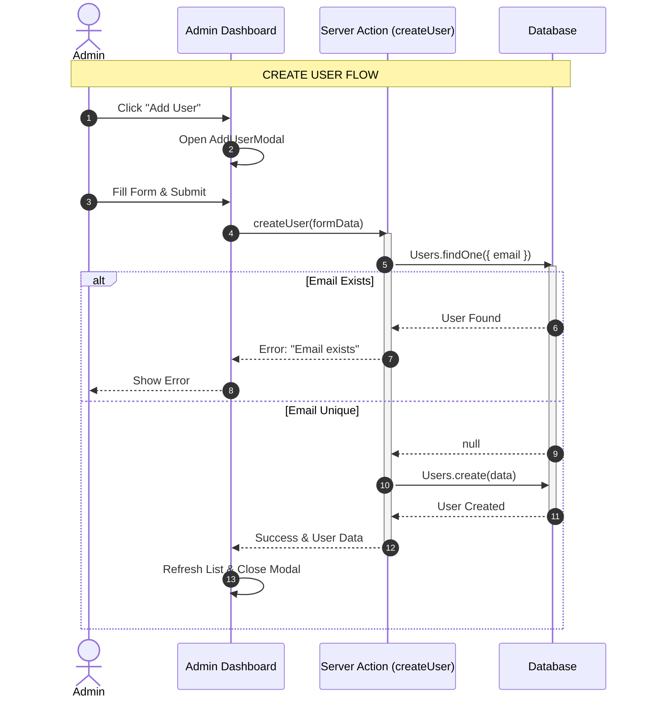
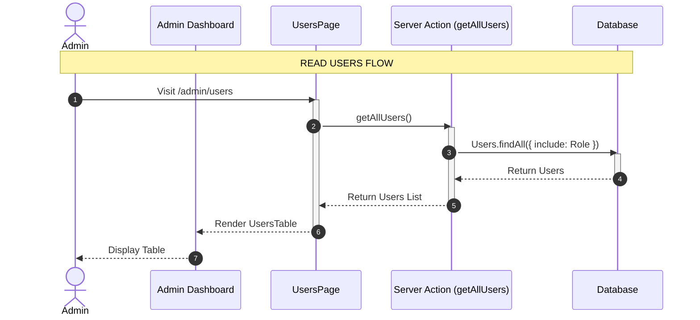
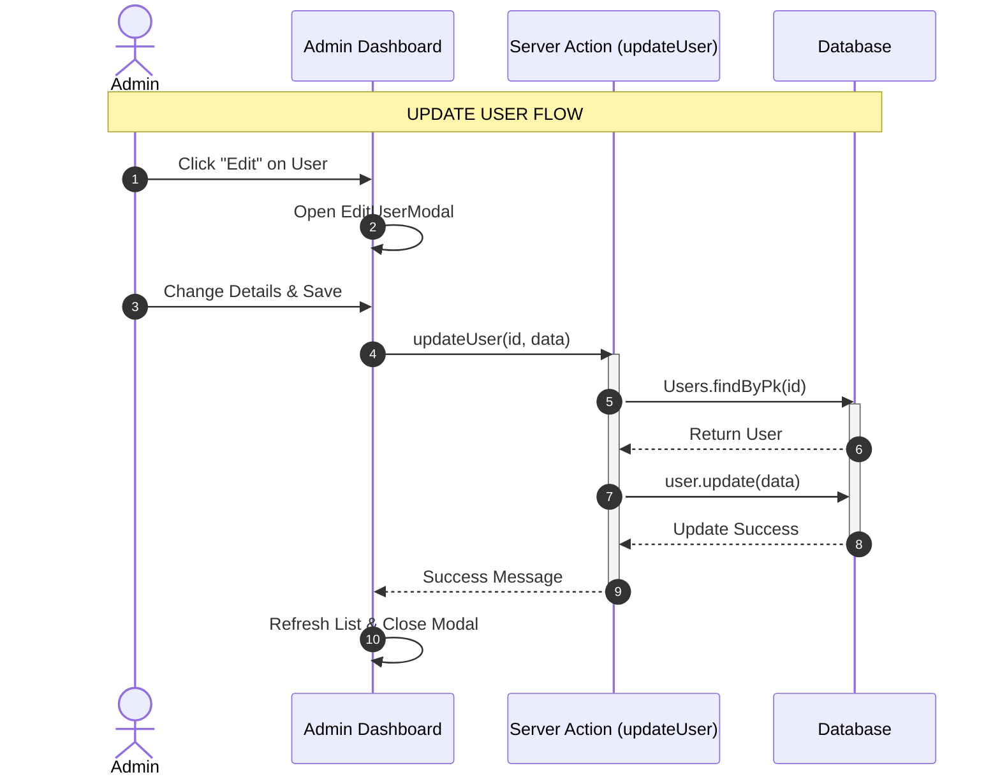
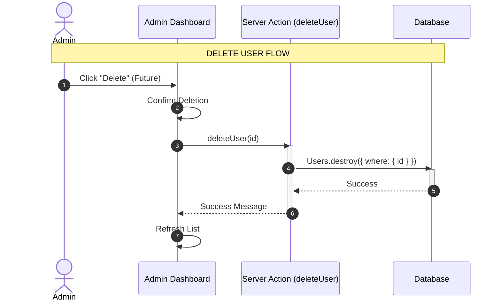

# User CRUD Sequence Diagrams

## 1. Create User

## 2. Read Users (List View)

## 3. Update User (Edit Details)

## 4. Delete User (Conceptual)

_Note: This feature is currently not implemented in the codebase._

